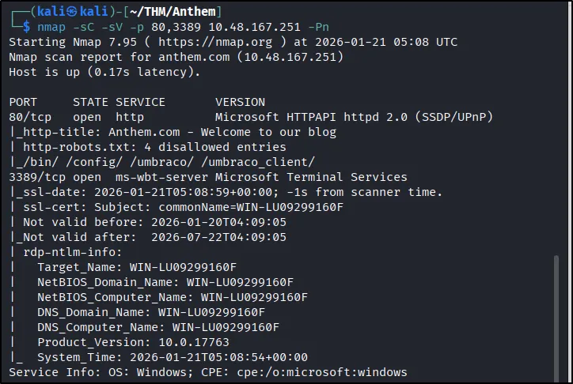
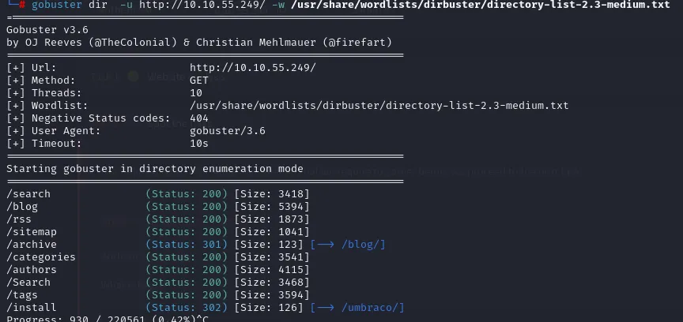
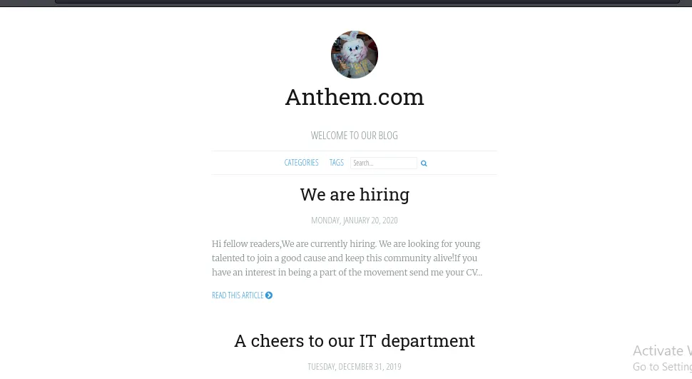
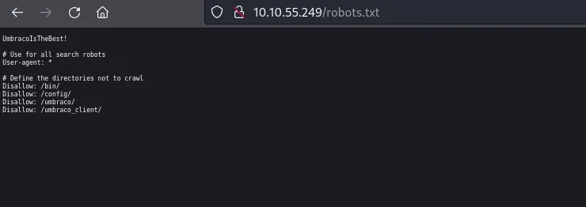
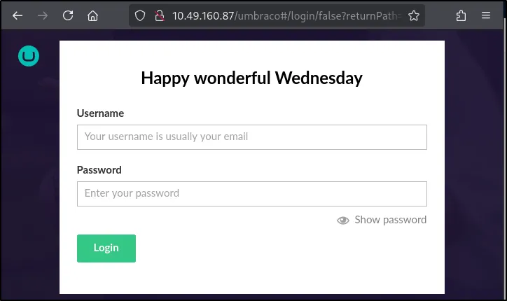
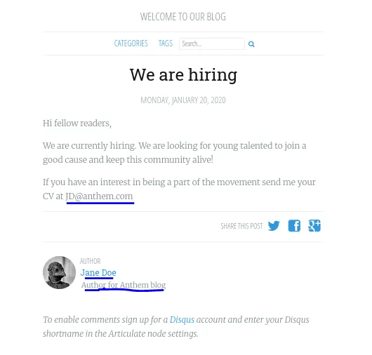
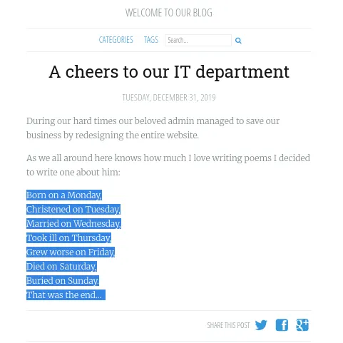
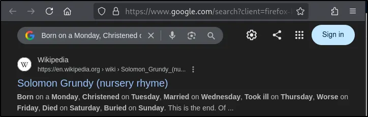

# 🛡️ Anthem – Windows Exploitation Writeup

Este repositório apresenta uma análise completa da máquina **Anthem** (TryHackMe), com foco em **raciocínio técnico, tomada de decisão e metodologia de exploração**.

Mais do que executar comandos, este writeup demonstra **como pensar como um analista de segurança**, correlacionando informações e adaptando estratégias ao longo do processo.

---

## 🎯 Objetivos Técnicos Demonstrados

* Enumeração ativa e passiva
* Web reconnaissance (manual + automatizado)
* Identificação de tecnologias (CMS)
* OSINT aplicado à exploração
* Exploração de credenciais
* Acesso remoto via RDP
* Enumeração local em Windows (GUI + CLI)
* Escalação de privilégios via permissões (ACL)

---

# 🔍 Fase 1 – Enumeração Inicial

## 🔧 Nmap Scan

```bash
nmap -A -p- <IP>
```

<p align="center">
  
</p>

---

## 🔎 Portas relevantes identificadas

| Porta | Serviço | Interpretação               |
| ----- | ------- | --------------------------- |
| 80    | HTTP    | Superfície web exposta      |
| 3389  | RDP     | Vetor de acesso remoto      |
| 445   | SMB     | Potencial enumeração futura |

➡️ **Insight:** Mesmo com poucos serviços, já existem múltiplos vetores de ataque viáveis (Web + RDP).

---

# 🌐 Fase 2 – Reconhecimento Web

## 🔎 Enumeração de diretórios

```bash
gobuster dir -u http://<IP>/ -w /usr/share/wordlists/dirbuster/directory-list-2.3-medium.txt
```


<p align="center">
  
</p>

➡️ **Objetivo:** Descobrir endpoints ocultos e superfícies adicionais de ataque.

---

## 🔍 Análise manual da aplicação

Durante a navegação no site, foram identificados:

* Estrutura de blog
* Categorias e tags
* Conteúdo aparentemente legítimo

<p align="center">
  
</p>

➡️ **Insight:** Ambientes CTF frequentemente simulam aplicações reais para esconder pistas em conteúdo aparentemente comum.

---

## 🔍 Análise do código-fonte

A inspeção manual (View Page Source) revelou:

* Comentários HTML ocultos
* Possíveis pistas deixadas por desenvolvedores
* Indícios da estrutura do sistema

[INSERIR IMAGEM: código fonte com comentários]

[INSERIR IMAGEM: devtools aberto]

➡️ **Insight:** Comentários no código são uma fonte comum de vazamento de informações sensíveis.

---

## 🤖 Análise do robots.txt

```
http://<IP>/robots.txt
```

<p align="center">
  
</p>

Conteúdo encontrado:

```
Disallow: /bin/
Disallow: /config/
Disallow: /umbraco/
Disallow: /umbraco_client/
```


➡️ **Conclusões:**

* Diretórios sensíveis expostos
* Forte indício de tecnologia utilizada

---

## 🧩 Identificação do CMS

➡️ CMS identificado: **Umbraco**

### 🔎 Evidências:

* Diretórios `/umbraco` e `/umbraco_client`
* Estrutura típica do CMS
* Página de login característica

```
http://<IP>/umbraco/#/login
```

<p align="center">
  
</p>

➡️ **Insight:** Identificar o CMS permite direcionar ataques específicos e buscar credenciais associadas.

---

# 🕵️ Fase 3 – OSINT e Enumeração de Identidade

## 📧 Informações coletadas

* Email encontrado: `jd@anthem.com`
* Domínio: `anthem.com`

<p align="center">
  
</p>

---

## 🔍 Análise de padrão

```
<iniciais>@anthem.com
```

➡️ **Insight:** Padrões corporativos de email são altamente exploráveis.

---

## 🧠 Descoberta via OSINT

Um poema encontrado no site chamou atenção.

<p align="center">
  
</p>

➡️ **Raciocínio aplicado:**

O conteúdo parecia não ser original → possível referência externa.

➡️ Ação:

* Trecho do poema foi pesquisado no Google


➡️ Resultado:

Referência a **Solomon Grundy**

<p align="center">
  
</p>

➡️ **Insight:** OSINT vai além de emails — envolve correlação de qualquer informação pública.

---

## 🔐 Derivação de credenciais

* Nome: Solomon Grundy
* Iniciais: SG

Email inferido:

```
sg@anthem.com
```

[INSERIR IMAGEM: tentativa de login]

Credenciais obtidas:

```
Usuário: sg@anthem.com
Senha: UmbracoIsTheBest!
```

➡️ **Insight:** Combinar OSINT + padrões internos pode levar diretamente ao acesso.

---

# 🚩 Fase 4 – Captura de Flags

## 📍 Metodologia utilizada

* Inspeção de código-fonte (Ctrl+U)
* Busca por palavras-chave
* Navegação em páginas secundárias

---

## 📌 Localizações

* `/authors` → Flag 1
  [INSERIR IMAGEM: flag authors]

* Homepage (source code) → Flag 2
  [INSERIR IMAGEM: flag no código fonte]

* Blog posts → Flags 3 e 4
  [INSERIR IMAGEM: flags no blog]

➡️ **Insight:** Flags raramente estão visíveis — exigem exploração ativa e atenção a detalhes.

---

# 🧪 Fase 5 – Exploração do CMS

Login realizado em:

```
/umbraco/#/login
```

[INSERIR IMAGEM: login realizado]

---

## 🔎 Testes realizados

* Upload de arquivos
* Criação de conteúdo
* Exploração de funcionalidades administrativas

[INSERIR IMAGEM: dashboard do umbraco]

➡️ **Resultado:**

Nenhuma funcionalidade permitiu execução de código ou acesso ao sistema operacional.

---

## 🔁 Decisão técnica (Pivot)

➡️ Mudança de estratégia para RDP

➡️ **Insight:** Saber abandonar um vetor improdutivo é essencial em um pentest.

---

# 💻 Fase 6 – Acesso Inicial via RDP

```bash
xfreerdp /f /u:SG /p:UmbracoIsTheBest! /v:<IP>
```

[INSERIR IMAGEM: conexão RDP]

[INSERIR IMAGEM: desktop acessado]

➡️ **Insight:** Serviços expostos + credenciais válidas = acesso direto ao sistema.

---

# 📂 Fase 7 – Enumeração Local (Windows)

## 🖥️ Via interface gráfica

* Navegação pelo File Explorer
* Ativação de arquivos ocultos

[INSERIR IMAGEM: ativando arquivos ocultos]

---

## 💻 Via linha de comando

```cmd
dir C:\ /a
```

```powershell
Get-ChildItem -Path C:\ -Recurse -Force
```

[INSERIR IMAGEM: enumeração via cmd]

➡️ **Insight:** CLI permite automação e análise mais profunda.

---

## 📁 Diretório sensível encontrado

```
C:\backup
```

[INSERIR IMAGEM: pasta backup]

Arquivo identificado:

```
restore
```

[INSERIR IMAGEM: arquivo restore]

---

# 🔓 Fase 8 – Escalação de Privilégios

## 🚫 Problema

Arquivo sem permissão de leitura

[INSERIR IMAGEM: erro de acesso]

---

## 🛠️ Exploração

Modificação de permissões:

1. Properties
2. Aba Security
3. Edit → Add
4. Adicionar usuário **SG**

[INSERIR IMAGEM: tela de permissões]

[INSERIR IMAGEM: alteração aplicada]

---

## ⚠️ Vulnerabilidade identificada

➡️ **Insecure File Permissions (ACL mal configurada)**

Impacto:

* Usuário comum acessa arquivo sensível
* Exposição de credenciais administrativas

---

## 🔑 Credenciais obtidas

```
Usuário: Administrator
Senha: ChangeMeBaby1MoreTime
```

[INSERIR IMAGEM: credenciais encontradas]

---

# 👑 Fase 9 – Comprometimento Total

```
C:\Users\Administrator\Desktop
```

Arquivo:

```
root.txt
```

[INSERIR IMAGEM: root flag]

---

➡️ **Resultado final:**

✔ Acesso administrativo
✔ Controle total do sistema
✔ Comprometimento completo da máquina

➡️ **Impacto real:** Em ambiente corporativo, isso representa uma falha crítica de segurança.

---

# 🛡️ Mitigações e Boas Práticas

* Remover informações sensíveis do robots.txt
* Implementar controle de acesso adequado (ACL)
* Evitar armazenamento de credenciais em texto plano
* Restringir acesso RDP (VPN / Firewall)
* Aplicar princípio do menor privilégio
* Monitorar acessos e atividades suspeitas

➡️ **Insight:** Segurança não é apenas explorar — é entender como prevenir.

---

# 🧠 Lições Aprendidas

* Enumeração é a fase mais crítica
* OSINT pode ser decisivo
* Padrões internos são exploráveis
* Nem todo acesso leva à exploração direta
* Pivoting é essencial
* Falhas de permissões são comuns em Windows

---

# 📊 Diferenciais Técnicos Demonstrados

* Correlação de informações (OSINT + Web)
* Pensamento analítico e estratégico
* Adaptação de abordagem (pivoting)
* Conhecimento prático de ambiente Windows
* Metodologia estruturada

---

# 📌 Considerações Finais

Este writeup foi desenvolvido com foco em:

✔ Clareza técnica
✔ Raciocínio documentado
✔ Reprodutibilidade
✔ Valor para recrutadores

---
